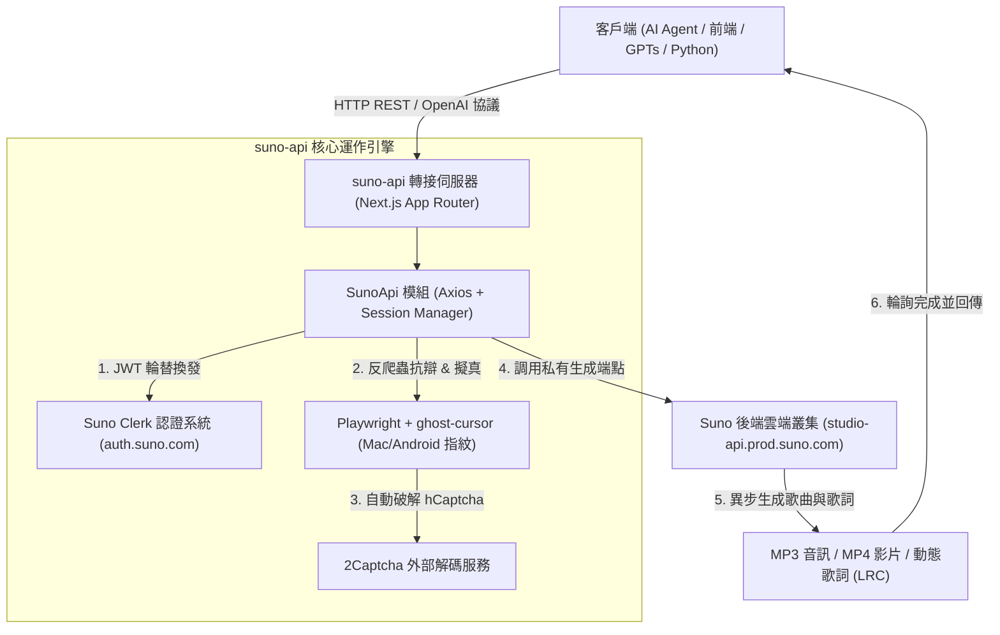

# 🎵 Suno AI 非官方 API (`gcui-art/suno-api`) 深入研究與架構剖析報告

> **專案倉庫**：[https://github.com/gcui-art/suno-api](https://github.com/gcui-art/suno-api)  
> **研究時間**：2026 年 10 月 02 日  
> **研究環境路徑**：`c:\Users\Anubis.Chan\Downloads\鐵人賽\實驗場所\suno-api\`  

---

## 📌 一、專案一句話定位與核心用途

**`gcui-art/suno-api`** 是一個基於 **Next.js 14 (App Router)** 開發的**開源 Suno AI 逆向工程 API 轉接層**。

由於 Suno.ai 官方目前並未公開對外開放開放式的 REST API，該專案透過模擬瀏覽器與行動 App 行為，將 Suno.ai 的內部生成機制封裝為**標準化的 HTTP RESTful API**，並額外提供了**相容 OpenAI `/v1/chat/completions` 協議**的端點，讓開發者能夠將 Suno 的 AI 音樂生成能力無縫嵌入到 AI Agent、GPTs、Discord Bot、自動化工作流或自製前端網頁中。

---

## 🛠️ 二、核心技術架構與運作原理



### 1. 認證機制與 Session 自動保持
- **認證方式**：使用者在瀏覽器登入 Suno.ai 後，提取其身分驗證 Cookie（特別是 `__client`、`__session` 或 Clerk 認證標頭）。
- **Token 自動續期**：Suno 使用 **Clerk** 作為身分驗證管理系統。該專案在 `SunoApi.ts` 中每隔數十秒至數分鐘，主動向 `https://auth.suno.com/v1/client/sessions/{sid}/tokens` 換取時效性極短的 JWT Bearer Token，藉此實現**永久維持帳號活躍**，解決 Cookie 容易過期的痛點。

### 2. 反爬蟲規避與風控繞過（Anti-Bot Strategy）
- **客戶端偽裝**：預設偽裝成 **Suno 官方 Android App**（標頭包含 `x-suno-client: Android prerelease-4nt180t 1.0.42`、`X-Requested-With: com.suno.android`）或 Macintosh Safari，有效避開網頁端嚴格的 Web 風控。
- **無痕自動化抗檢測**：採用修訂版無頭瀏覽器 `rebrowser-playwright-core`，清除了 Chrome DevTools Protocol (CDP) 的自動化特徵，結合 `ghost-cursor-playwright` 產生高仿真的真人滑鼠曲線軌跡。
- **驗證碼自動破解**：對接商業人機驗證打碼平台（`2Captcha` / `ruCaptcha`），當觸發 hCaptcha 攔截時自動將題目送出辨識並回填 token。

### 3. 特殊亮點：OpenAI 格式向下相容
- 專案在 `/src/app/v1/chat/completions/route.ts` 實現了 OpenAI 格式相容層。
- 只要在支援自訂 API Base URL 的聊天客戶端（如 Dify、NextChat、Chatbox、FastGPT 等）中，將模型位址填入本服務，輸入「創作一首關於香港夜景的 City Pop」，系統即會呼叫 Suno 生成，並將音訊播放連結以 Markdown 格式包裝為 AI 助理回覆！

---

## 📡 三、主要開放之 API 端點清單

| 端點 (Endpoint) | HTTP 方法 | 功能說明 | 核心參數 / 特色 |
| :--- | :---: | :--- | :--- |
| `/api/generate` | `POST` | **描述生成音樂**（簡易模式） | `prompt`: 文字描述（如 "Upbeat 80s synthwave"）、`make_instrumental`: 是否純音樂 |
| `/api/custom_generate` | `POST` | **自訂模式生成**（專家模式） | `prompt`: 歌詞內容、`tags`: 風格標籤（如 "rock, female vocal"）、`title`: 歌曲名稱 |
| `/api/extend_audio` | `POST` | **歌曲片段延長** | `audio_id`: 來源歌曲 ID、`continue_at`: 接續時間點（秒） |
| `/api/concat` | `POST` | **完整曲目拼接** | 將延長後的各片段組裝成一首完整音訊檔案 |
| `/api/generate_lyrics` | `POST` | **AI 智慧寫詞** | 透過 Suno 的語言模型生成符合音樂押韻結構的歌詞 |
| `/api/get_aligned_lyrics`| `GET` | **動態歌詞時間軸** | 取得卡拉 OK 般的字詞對齊時間標記（時間戳記） |
| `/api/generate_stems` | `POST` | **音軌分離 (Stems)** | 將成品拆解成人聲軌（Vocals）與伴奏軌（Instrumental） |
| `/api/get` | `GET` | **查詢音訊資訊與進度** | 查詢單首或批次歌曲的生成狀態（`streaming` / `complete`）與 MP3 URL |
| `/api/get_limit` | `GET` | **查詢帳號剩餘點數** | 查詢每日與每月剩餘 Credits（積分）及配額上限 |
| `/v1/chat/completions` | `POST` | **OpenAI 相容端點** | 讓 LLM 工具、GPTs Actions 與 Agent 平台直接呼叫 |

---

## 💻 四、部署與執行方式

### 方式 A：Vercel 一鍵無伺服器部署（最簡便）
專案支援直接部署至 Vercel Serverless Functions：
1. Fork 該倉庫到自己的 GitHub。
2. 在 Vercel 建立新專案並連結倉庫。
3. 設定環境變數：
   - `SUNO_COOKIE`：從瀏覽器 `suno.com/create` 提取之登入 Cookie。
   - `TWOCAPTCHA_KEY`：（可選）若遇到驗證碼需填寫 2Captcha API Key。

### 方式 B：本地端或 Docker 容器化運行
```bash
# 1. 進入目錄並安裝依賴
npm install

# 2. 設定環境變數 .env
echo "SUNO_COOKIE=你的_Suno_Cookie" > .env

# 3. 啟動本機開發伺服器
npm run dev
# 伺服器將運行於 http://localhost:3000
```

---

## ⚖️ 五、優缺點分析與潛在風險

### 🌟 優點
1. **填補官方空白**：在 Suno 尚未釋放商業 API 之前，提供完全程式化控制音樂生成的途徑。
2. **豐富的功能覆蓋**：幾乎 1:1 復刻了 Suno 網頁端的全部能力（包含寫詞、自訂風格、續寫、分軌）。
3. **極高的整合相容性**：原生相容 OpenAI API 格式與 Swagger 文件，能與現有 AI 生態系無縫銜接。

### ⚠️ 風險與限制
1. **帳號封禁風險（Account Ban）**：Suno 官方服務條款（Terms of Service）嚴格禁止未經授權的自動化腳本與逆向 API 調用，頻繁調用可能導致帳號被凍結或封禁。
2. **依賴 2Captcha 付費打碼**：若未使用打碼服務，在觸發 hCaptcha 攔截時請求將直接失敗。
3. **接口變更脆弱性**：Suno 後端架構若更新 Clerk 版本或調整反爬蟲指紋，該專案可能隨時失效，需等待開源社群維護修復。
4. **著作權合規問題**：免費用戶生成的音樂在 Suno 規範中不得作為商用，若用於專案需確認所綁定帳號的訂閱層級（Pro / Premier）。

---

## 🚀 六、與鐵人賽專案（Vibe Coding / 跨領域）的應用結合點

在我們目前的鐵人賽主題中，此專案具備相當有創意的延伸方向：
1. **AI 背景音樂即時生成器**：
   - 結合前面的前端或遊戲化原型（如 Day 09 咖啡色計劃、Day 10 絕地武士、Day 05 ASMR），在網頁中輸入主題氛圍，透過 API 即時呼叫 Suno 產生專屬背景配樂（BGM）。
2. **跨領域多模態展示**：
   - 先由 Gemini / Claude 生成歌詞與曲風 Tag，再透過該 API 送入 Suno 生成曲目，最後以 Three.js 或 HTML5 Canvas 呈現動態音波視覺化（Audio Visualizer），打造完整的多模態 AI 創作管線。
